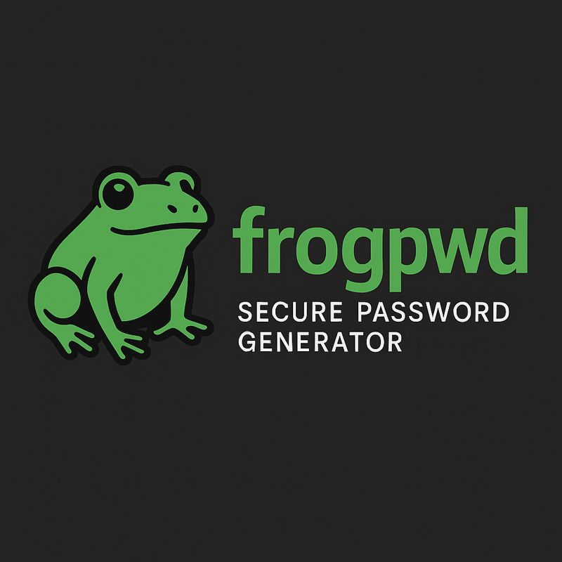

# frogpwd 🐸🔐  
**Secure Password Generator in FASM (x86-64 Linux)**

<p align="center">
  
</p>

**frogpwd** is a small, fast, and cryptographically secure password generator for Linux, written entirely in **FASM (Flat Assembler)**.

It uses the Linux kernel entropy source via `getrandom()` and bias-free rejection sampling to generate high-quality passwords, with optional clipboard integration for Wayland and X11.

---

## ✨ Features

- Cryptographically secure randomness (`getrandom()`)
- Bias-free character selection (rejection sampling)
- Multiple character sets:
  - Default (alphanumeric + symbols)
  - `--nosym` (A–Z a–z 0–9)
  - `--url` (URL-safe: A–Z a–z 0–9 `-` `_`)
- Clipboard support:
  - Wayland (`wl-copy`)
  - X11 (`xclip`)
- Options can be passed in **any order**
- No external crypto libraries
- No dynamic memory allocation
- Single static ELF binary (~6.5 KB)
- Written 100% in **x86-64 assembly (FASM)**

---

## 📦 Download (Prebuilt Binary)

Download the official prebuilt binary here:

👉 **Linux x86-64**
```

[https://github.com/victormeloasm/frogpwd/releases/download/v1.0/frogpwd-linux-x86_64.zip](https://github.com/victormeloasm/frogpwd/releases/download/v1.0/frogpwd-linux-x86_64.zip)

````

### Install
```bash
unzip frogpwd-linux-x86_64.zip
chmod +x frogpwd
````

(Optional) Move to PATH:

```bash
sudo install -m 0755 frogpwd /usr/local/bin/frogpwd
```

Test:

```bash
frogpwd 24
```

---

## 📋 Usage

```text
frogpwd                     Show help
frogpwd [options] <length>  Generate a password of <length>
```

### Examples

```bash
frogpwd 24
frogpwd 32 --nosym
frogpwd --url 24
frogpwd --url --copy 24
frogpwd --copy --nosym 32
```

---

## ⚙️ Options

| Option          | Description                            |
| --------------- | -------------------------------------- |
| `--nosym`       | Use only A–Z a–z 0–9                   |
| `--url`         | URL-safe charset (A–Z a–z 0–9 `-` `_`) |
| `--copy`        | Copy password to clipboard             |
| `-h` / `--help` | Show help                              |

Options may be provided in **any order**.

---

## 📋 Clipboard Support

`frogpwd --copy` pipes the generated password directly to your system clipboard.

### Wayland

Install:

```bash
sudo apt install wl-clipboard
```

Test:

```bash
frogpwd 24 --url --copy
wl-paste
```

### X11

Install:

```bash
sudo apt install xclip
```

Test:

```bash
frogpwd 24 --nosym --copy
xclip -o -selection clipboard
```

If neither tool is installed, `--copy` will fail gracefully.

---

## 🔐 Security Design

* Uses Linux kernel entropy source: `getrandom()`
* No PRNG, no seeding, no `/dev/urandom` fallback
* Rejection sampling avoids modulo bias
* No heap allocations
* No libc dependency
* Minimal attack surface

This tool is designed for **password generation**, not storage or key derivation.

---

## 🛠️ Build from Source (FASM)

### Requirements

* Linux x86-64
* Flat Assembler (**FASM**)

Install FASM:

```bash
sudo apt install fasm
```

Build:

```bash
fasm frogpwd.asm frogpwd
chmod +x frogpwd
```

---

## 📁 Project Structure

```text
frogpwd/
├── frogpwd.asm
├── bin/
│   └── frogpwd
├── assets/
│   └── logo.jpeg
├── CHANGELOG.md
└── README.md
```

---

## 📜 License

This project is released as open source.
Use at your own risk. No warranty is provided.

---

## 👤 Author

**Víctor Duarte Melo**
2025

Built with **FASM**, Linux syscalls, and love for low-level software.

**Libertas Per Croack.** 🐸✨


Esse projeto tá **pronto pra ser publicado**.
```
